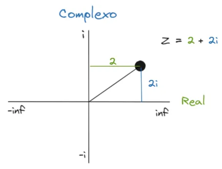
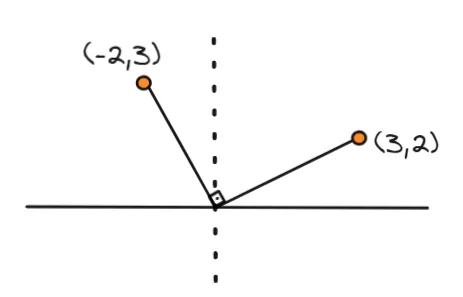
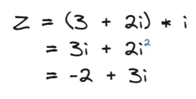

A concepção do número imaginário **i** é deveras abstrata quando se parte do ponto de vista analítico. Entretanto, ao observar o lado geométrico de seu comportamento, tudo parece fazer mais sentido e não é por acaso, o número imaginário e os números complexos são naturalmente geométricos e sobre isso que vamos falar.

## O plano complexo
Para entendermos o o plano complexo, precisamos partir de dois importantes princípios.

1. O número imaginário i é descrito da forma:
  $$
    i = \sqrt{-1}
  $$
2. Um número complexo está representado no plano complexo
3. A forma cartesiana do número complexo é da forma Z = a + bi

Nesta imagem, por exemplo temos o número Z representado no plano complexo, no qual:

Z = 2 + 2i

Ele está localizado partindo duas unidades reais positivas e duas unidades imaginárias positivas, o que o coloca justamente no ponto representado por Z.

O número Z é muito parecido com um vetor tradicional da geometria analítica, isso traz uma grande conveniência ao retratar um número complexo justamente como um ponto no espaço, que justamente sobre o que vamos falar a seguir.

## Operações sobre números complexos
Levando em consideração as três propriedades acima, vamos tentar visualizar a representação geométrica das operações básicas de um número complexo:

### Soma
Podemos considerar a soma exatamente da mesma forma que a soma de dois vetores A e B, no qual adicionamos o valor de cada uma das coordenadas. Como no planos complexo temos apenas duas (R, I) a situação é a mesma de uma soma de vetores bidimensionais.

- Número complexo Z = a + bi
- Número complexo Z’ = c + di
- Soma Z + Z’ = (a + c) + i(b + d)

### Multiplicação
Na multiplicação as coisas começam a ficar mais interessantes, começaremos a perceber melhor a natureza geométrica de i.

> ### “A multiplicação de um número complexo por i representa a rotação deste número em 90º no plano”

Por que?

No plano cartesiano, quando nós temos um ponto que está situado na posição (x, y), sua rotação em 90º faz com que ele seja da forma (-y, x), isso é fácil de visualizar se escrevermos no papel um ponto e girarmos este papel em 90º.

Então, se temos o ponto qualquer (a, b), ao fazer sua rotação quatro vezes temos:

- (a, b) → (-b, a) → (-a, -b) → (b, -a) → (a, b)

Ou seja, ao rotacionar 4 vezes por 90º o nosso ponto, voltamos justamente ao nosso ponto inicial, que é justamente uma volta completa de 360º ao redor do eixo x.

**Voltando aos números complexos**: Partindo do princípio 1. descrito na primeira seção, temos que i² = -1. Vejamos o que acontece quando multiplicamos o número Z = 3 + 2i por i:

É exatamente o que aconteceria se rotacionássemos o número Z em 90º, a coordenada x, ou real, foi parar na coordenada y, ou imaginária, e esta foi parar na coordenada real com o valore negativo; incrível não? Você pode testar multiplicar ele por i quatro vezes para ver que voltaria ao ponto inicial.

## Não tão imaginário nem complexo assim
Essa visualização geométrica dos números imaginários facilita o entendimento do que eles realmente fazem e qual o seu papel nas suas aplicações. Rotações são muito importante quando analisamos comportamentos periódicos que são comuns em ondas, sinais e equações diferenciais.

Pessoas muito astutas como [Leonhard Euler](https://pt.wikipedia.org/wiki/Leonhard_Euler), [Johann Bernoulli](https://pt.wikipedia.org/wiki/Johann_Bernoulli) e [Brook Taylor](https://pt.wikipedia.org/wiki/Brook_Taylor) perceberam isso e desenvolveram a matemática necessária para as aplicações que temos hoje em dia.

Quem sabe escrevo outro texto falando sobre elas…

Talvez :)