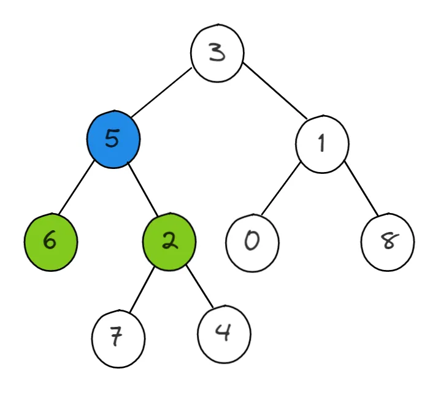
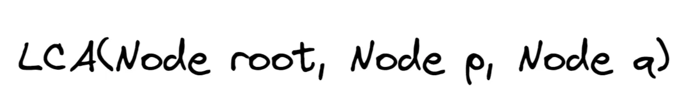
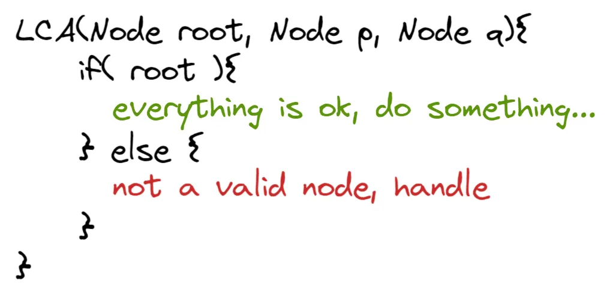
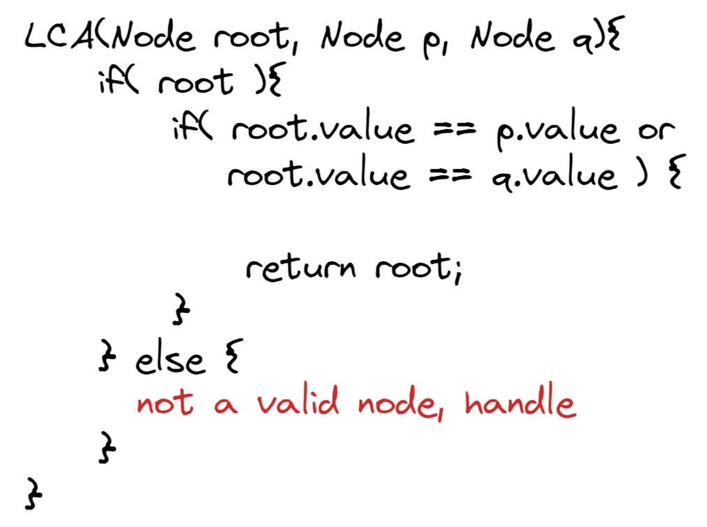
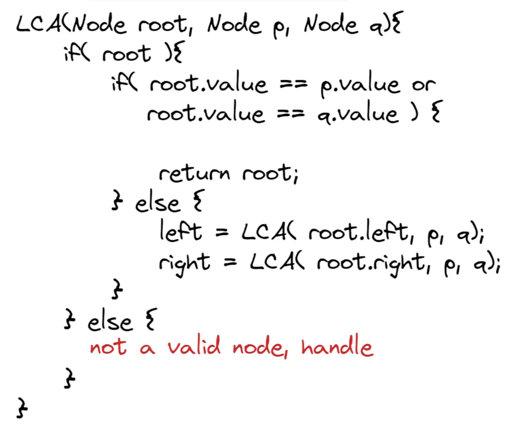
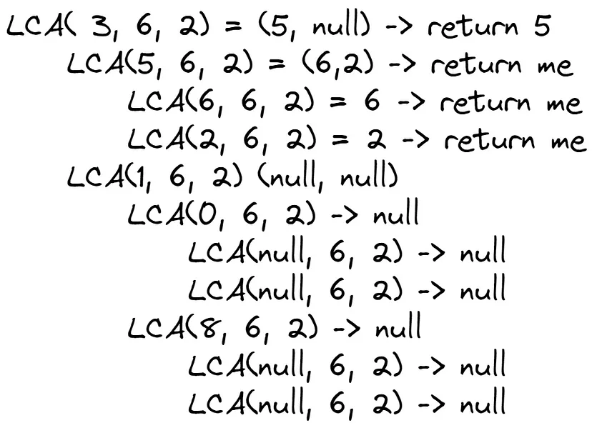
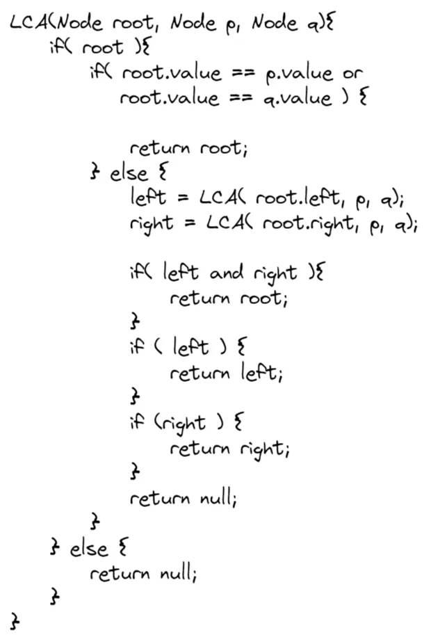

# What is it?
This is a concept within the topic of algorithms and data structures, more specifically about tree, which is a special type of a graph. The idea is that given a binary tree and two nodes of that same tree, you need to find a node that is above that two given to you in the beginning.

Thinking through analogy. If the given tree is your family heritage tree, and the nodes given are you and your sibbling (suppose you have one), the lowest common ancestor (LCA) of you two are your parents (suppose a pair of parents is a node). Why? Because it is the closest node from the tree that includes both of you in it’s subtree.

Let me try to explain through an image:



Having this tree as an example, the LCA of 6 and 2 is 5. Because 5 is the node that has both 6 and 2 in it’s subtree. Well, one might wonder: “3 also has 6 and 2 in one of it’s subtrees, why isn’t this the LCA?”. Good question, i would say. The node 3 cannot be the LCA because it is not the lowest one, where the concept of lowest comes from the height of the tree, being the root the top and the leafs the bottom.

There is also a nuance in the problem: who the common ancestor from 5 and 2? There are two options here, we can consider a node to be it’s own ancestor or not. In this article i will consider that a node can be it’s own ancestor, so the answer would be 5.

Now that we understand the problem we can try to solve it through an algorithm, and that is exacly what i’ll do in the next step.

## Pseudocode
First of all let’s define the function that will receive the input of the tree and the two nodes:



The first thing we have to verify when we recieve a node from a tree is to check if it`s a valid node or not. So the overall structure would be something like that:



Now we know that when we have a input, we can manipulate it properly without ending up checking something from a null node, for instance.

The purpose of the LCA is to check if a node has other nodes in it’s subtree. So first we will check the existence of either of p or q and leave the case where a unvalid node is passed as argument in stand by for a moment.



This part was very counterintuive for me when i first learned about it. Why would i return the node if i found it? For me, was best to store it somewhere to know that i found it, and then, afterwards, i could check the ones that i found in a vector somewhere, but there is a huge problem with that: If stored the ones i found, how would i know it’s common ancestor? I would have information only about the nodes itself, not about who’s before or after.

This return enables the algorithm to have a answer ready from the start, because if my inputs are the nodes 3 and 5, i would return 3 as an answer without having to check anything else, because no one is higher than the root.

This will happen if we arrive at a desired node, if we are in a node that is not one that we want, we need to keep searching for him in the entire tree left. So we keep searching.



I recursively try to find the desired nodes and this step is a huge one that defines our solution. Because this is recursive, every call of LCA will start as if it is in another root. When we search for the LCA of 6 and 2. We recursively searching for them in various trees which are subtrees of the original one; each one of theses subtrees exists in the call stack of the recursion in this manner:



The algorithm keeps looking for the desired nodes until we hit a null node, which is the end of a branch, or if we actually find it, in this case we return the found node, as described above.

From this, three things can happen:

1. We find no nodes
2. We find 1 node in one of the sides
3. We find 2 nodes, one in each side
If we find no nodes, that’s trivial, nothing can come from this, so we just return a null value.

If we found one of the nodes, this means that i might be the LCA, or the node found is a LCA, because remember the calls are recursive, it means that i’m diving into the tree, so at some point i will arrive at the LCA and when that happens, i need to pass this information to the nodes above that made the call in the first place. So i need to return the node i found because it can be the LCA found in a subtree somewhere below.

If i found two nodes, well, then i’m the LCA and i need to tell this to the nodes above me returning me as answer.

Keep in mind that despite returning the answer when we found the nodes at our left and our right, the LCA call that will return the final answer will be the one at the root. So the LCA found somewhere deep in the three must be bubbled up to the top through the recursive calls.

So to do that we need to check what our calls of the function returned to us in each level of the call stack and return the information accordingly as said above. We can do it this way:



This completes the algorithm and solves completely our problem. It ended up being simpler than one would’ve thought but it attends to all the needs.

It checks if we arrived at the desired values.

It checks in the left and right subtrees if we haven’t arrived at the desired values.

It detects who is the LCA when arrived at it.

And it transmits the information about who is the LCA to the nodes above.

Having this pseudocode we can now build a real implementation in any language we want. As an example, i will provide my solution written in C++ below.

## Implementation in C++

After all to work walking through the pseudocode, the actual implementation comes quite easy because the steps are extremely similar.

```c++
// https://gist.github.com/fnalmeidap/134c5736cf547727eebb246bb25babe9#file-lowestcommonancestor-cpp

struct Node {
    int value;
    Node *left;
    Node *right;
};

class Solution {
public:
    Node* LowestCommonAncestor(Node* root, Node* p, Node* q){
        if(root){
            if(root -> value == p -> value || root -> value == q -> value){
                return root;
            } else {
                auto left = LowestCommonAncestor(root, p, q);
                auto right = LowestCommonAncestor(root, p, q);
                
                if( left && right ){
                    return root;
                }
                if( left ){
                    return left;
                }
                if( right ) {
                    return right;
                }
                return nullptr;
            }
        } else {
            return nullptr;
        }
    }   
};
```