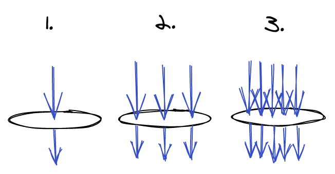
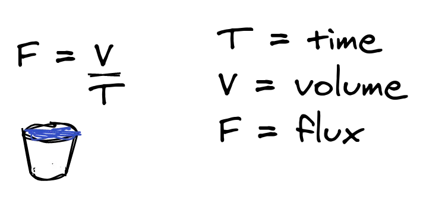
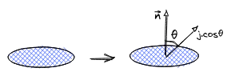

Born with mathematicians but accepted with love by physics, the concept of flux is something that really staggered me when i was first introduced in my late calculus classes. Besides being angry about not knowing how to solve integrals and many algebraic manipulations that made me think twice if i really should be studying engineering, these classes created on me a authentic interest in the flux idea; i don’t know why, i was just fascinated by it and whenever it came up again in further exercises or topics it always made my eyes shine.

Ok, but, what actually is the flux? Well, i love to start it simple so, imagine this: You are married, and everytime you and your partner have dinner, both of you discuss about who should wash the dishes. Because you are a lovely husband/wife you say: “go on honey, i can take this, i have a plan”. You get your plates, goes to the sink and opens the tap as wide as possible so the water comes fast and in a huge amount. All you have to do is put your plates in the waterpath and voilà, the dishes are clean and you barely touched any waste. The plan goes well until when the month ends and your water bill gets way more expensive than usual! Why is that? Well, because of the flux!!!

The flux is the amount of *something* that goes through any surface, in this specific case, the water going through the tap hole, which is a circle, or any other format if you have a fancy tap, mines are circles. Easy right? But let me show you with a beautiful drawing:

The first situation is a low flux situation, where you openned the tap just a little bit. The second one is a normal situation and the last one is what happens if someone has a fancy plan like yours. A lot more of water comes through that tap hole and that is why your bill is so expansiveç oh you’re so naive, aren’t you?

This conclusion is trivial and sort of intuitive, right? If you put a bucket bellow it, the more water goes through the tap hole the more you will have after a certain period of time, this is determined by this relation on the left and is easy to deduce, but let’s try to think about it from another point of view. Let’s get that same circle area from the tap where the water passes through and divide it in small subsections. Now we have that hole circle area defined by lots of lots small squares. But one might say: “What about the borders? We can’t fit squares around there”, and you’re right my friend; doesn’t matter how may small little squares you have in this circle, you will never reach the entire area because in the borders you can’t have perfect squares. Unless you have infinite squares, that’s right. In mathematics this abstraction is used to calculate, amogst other things, areas in term of small pieces, like squares, this concept is called integralization!

To do it, a lot of steps needs to be taken, but to make it simple, i will divide the requirements in only two:

### 1. The direction of the flux relative to the surface
In our example, the water comes straight from the top with a 90 degree angle relative to the circle surface, so the water that comes in is exactly the water that comes out given a period of time. But, to use a mathematical rule we can’t only depend on straight sharp angles, we need to generalize it for any angle that the water(or anything else we want to measure) comes, that’s why we need a normal vector (n), which can be interpreted as a baseline from where the flux(j) can vary upon. Then we can compare how close is the flux vector relative to the normal vector, and it will aways be proportional to cosθ.

### 2. Sum of the flux in all infinite squares
Having the flux vector j, we need to consider infinite vectors, one for each little square inside the circle. Each one of them represents the individual flux of the infinitesimal squares, adding them all up will give us the total flux of the circle area. That can be matematically discribed as:
  $$
    \iint_S j\cdot\hat{n}dA = \iint_S j\cdot dA
  $$
## Conclusion
This expression determined above can be a little strange if you missed your calculus classes (or if you are from a different field of study 😛) but it represents a lot of concepts in math and even in physics like current, eletric field, heat transfer, etc. It makes easy a lot of calculations that otherwise would be bothersome and difficult. Not only through math expressions but the flux intuitive concept is something that occurs often and visualizing it may open your mind to inner perspectives about the world around us.